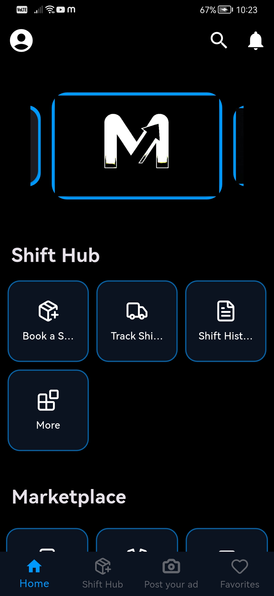

Movora – Shift Booking App (Flutter UI)

A clean and modern UI for booking shifts in the Movora application.
This project demonstrates Flutter UI skills and includes multiple screens such as:

Shift Booking

Order Details

Progress Timeline

Delivery Address

Upcoming Shifts

User Dashboard

The app showcases layout design, component usage, and integration with location services using geolocator and geocoding.

Features

Select shift date and time

View detailed order information

Step-based progress indicator for booking status

Clean and modern UI design

Modular and reusable widgets

Integrated location services using geolocator and geocoding

Screenshots included for visual reference

